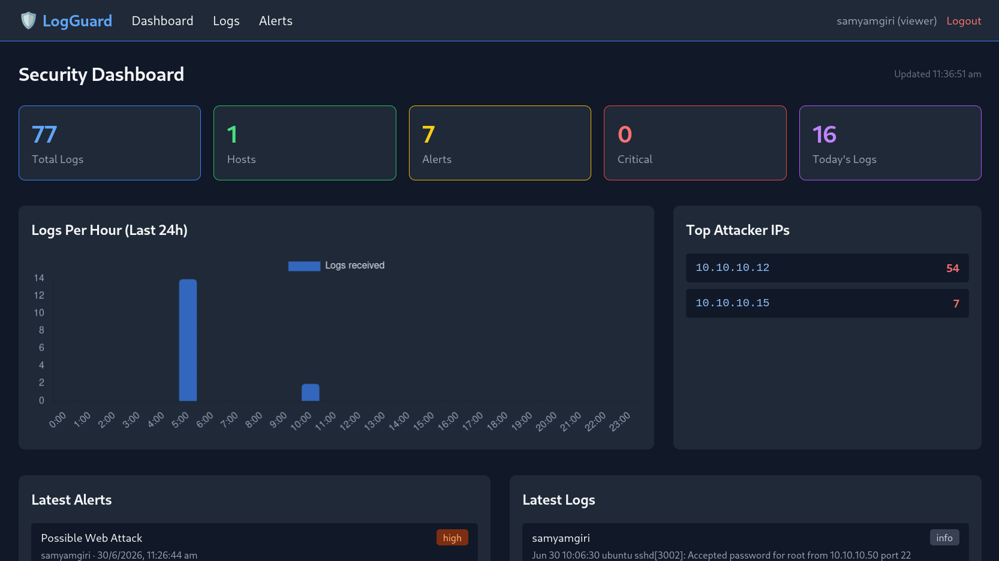
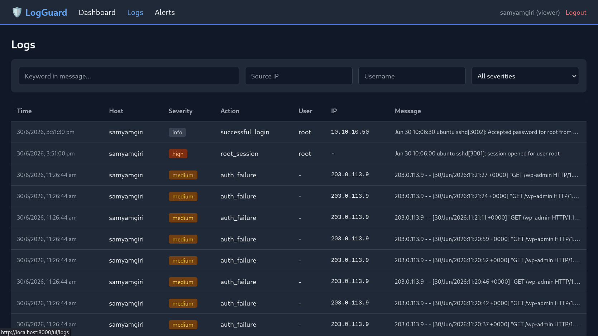
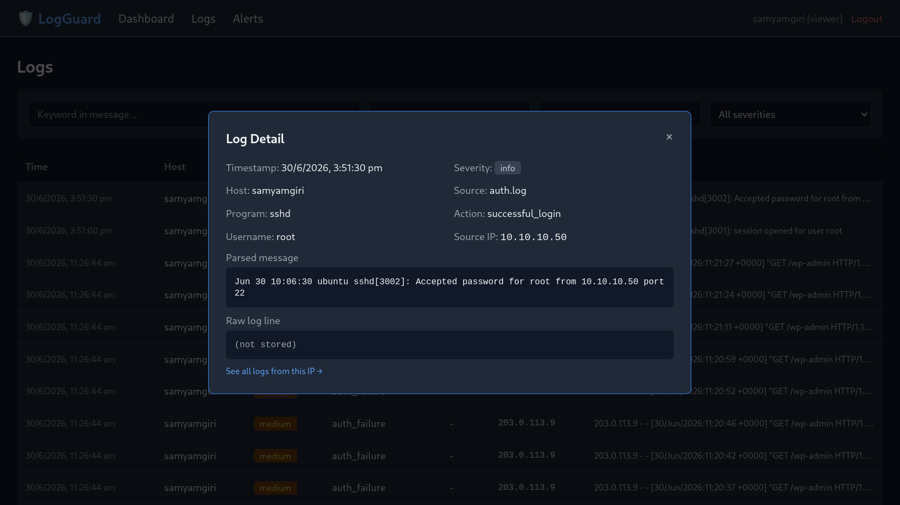
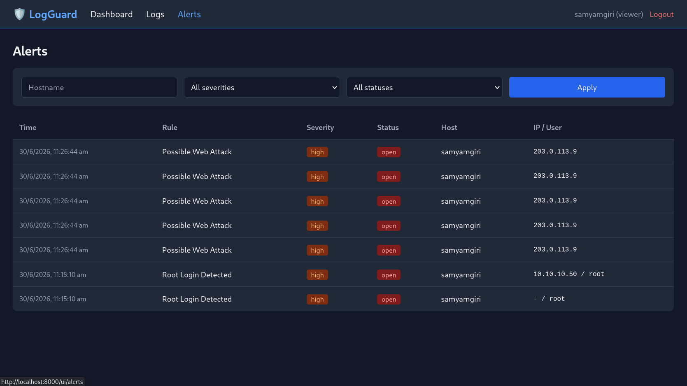
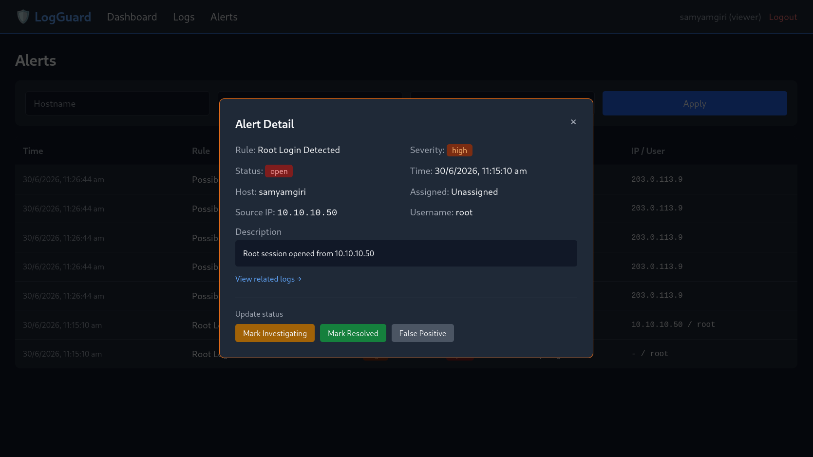

# 🛡 LogGuard-SIEM 

A mini Security Information & Event Management (SIEM) platform built from scratch with **FastAPI** and **PostgreSQL**. It ingests security logs (SSH auth, sudo, nginx access logs), parses them into structured fields, runs them through a rule-based detection engine, and surfaces alerts and log activity through a REST API and a web dashboard.

> 🚧 **Status:** Phases complete (project scaffold → database models → JWT auth → host management → log ingestion → detection engine → dashboard/search APIs → interactive frontend). This README will be updated as later phases (Docker, Nginx, monitoring, CI/CD, deployment) are completed.

---

## Features

- **JWT authentication** with bcrypt password hashing and role-based access (admin / analyst / viewer)
- **Host management** — register and track monitored machines
- **Log ingestion API** — single and batch ingestion, with a regex-based parser that extracts hostname, program, user, source IP, and action from raw syslog/nginx lines
- **Rule-based detection engine** — automatically generates alerts on every ingested log:
  - SSH Brute Force (5+ failed logins from one IP in 5 minutes)
  - Privilege Escalation Attempt (sudo authentication failure)
  - Root Login Detected
  - Credential Sharing Detected (3+ distinct users from one IP in 1 hour)
  - Possible Web Attack (10+ HTTP 401/403 from one IP in 10 minutes)
- **Dashboard API** — aggregate stats, logs-per-hour, top attacker IPs, top failed users
- **Search API** — filter logs by keyword, IP, username, hostname, severity
- **Web frontend** (Jinja2 + Tailwind + Chart.js):
  - Login page with JWT stored client-side
  - Dashboard with live stat cards and an auto-refreshing logs-per-hour chart
  - Logs page with real-time search/filter and a click-to-expand detail view (parsed fields + raw log line)
  - Alerts page with real-time filter and a detail view with inline status resolution (Investigating / Resolved / False Positive)

---

## Tech Stack

| Layer | Technology |
|---|---|
| API framework | FastAPI |
| Database | PostgreSQL 15 |
| ORM / migrations | SQLAlchemy 2.0 + Alembic |
| Auth | JWT (python-jose) + bcrypt (passlib) |
| Frontend | Jinja2, Tailwind CSS (CDN), Chart.js |
| Testing | pytest |
| Environment | Kali Linux, Python 3.13 |

---

## Screenshots

| Dashboard | Logs |
|---|---|
|  |  |

| Log Detail | Alerts |
|---|---|
|  |  |

| Alert Detail |
|---|
|  |

---

## Quick Start

```bash
# 1. Clone and enter the repo
git clone https://github.com/SamyamCodesavvy/log-guard-siem.git
cd log-guard-siem

# 2. Set up Python environment
python3 -m venv venv
source venv/bin/activate
pip install -r requirements.txt

# 3. Start PostgreSQL (Docker)
docker run -d --name siem-postgres \
  -e POSTGRES_USER=siem_user -e POSTGRES_PASSWORD=siem_pass -e POSTGRES_DB=siem_db \
  -p 5432:5432 postgres:15

# 4. Configure environment
cp .env.example .env   # then edit SECRET_KEY etc.

# 5. Run migrations
alembic upgrade head

# 6. Start the app
uvicorn app.main:app --reload --host 0.0.0.0 --port 8000
```

Then visit:
- **Web UI:** `http://localhost:8000/ui/login`
- **API docs (Swagger):** `http://localhost:8000/docs`

---

## API Endpoints

| Method | Endpoint | Description | Auth |
|---|---|---|---|
| POST | `/auth/register` | Register new user | No |
| POST | `/auth/login` | Login, get JWT token | No |
| GET | `/auth/me` | Get current user | Yes |
| POST | `/hosts/` | Register a host | Yes |
| GET | `/hosts/` | List hosts | Yes |
| PUT | `/hosts/{id}` | Update host | Yes |
| DELETE | `/hosts/{id}` | Delete host | Yes |
| POST | `/logs/` | Ingest a single log | Yes |
| POST | `/logs/batch` | Ingest multiple logs | Yes |
| GET | `/logs/` | List logs (with filters) | Yes |
| GET | `/logs/{id}` | Get log detail | Yes |
| GET | `/alerts/` | List alerts | Yes |
| GET | `/alerts/{id}` | Get alert detail | Yes |
| PUT | `/alerts/{id}/resolve` | Update alert status | Yes |
| GET | `/dashboard/` | Dashboard statistics | Yes |
| GET | `/search/` | Search logs | Yes |
| GET | `/health` | Health check | No |

---

## Detection Rules

| Rule | Trigger | Severity |
|---|---|---|
| SSH Brute Force | 5+ failed logins from the same IP within 5 minutes | Critical |
| Privilege Escalation Attempt | Failed sudo authentication | High |
| Root Login Detected | Root session opened or root login succeeds | High |
| Credential Sharing Detected | 3+ distinct usernames logging in from the same IP within 1 hour | Medium |
| Possible Web Attack | 10+ HTTP 401/403 responses from the same IP within 10 minutes (nginx logs) | High |

---

## Project Structure

```
log-guard-siem/
├── app/
│   ├── api/            # FastAPI routers (auth, hosts, logs, alerts, dashboard, search, ui)
│   ├── authentication/ # JWT + bcrypt logic
│   ├── detection/       # Rule-based detection engine
│   ├── models/          # SQLAlchemy ORM models
│   ├── schemas/          # Pydantic request/response schemas
│   ├── services/         # Business logic (host, dashboard)
│   ├── static/js/        # Frontend auth/fetch helpers
│   ├── templates/        # Jinja2 pages (login, dashboard, logs, alerts)
│   └── main.py
├── tests/                 # pytest suite
├── alembic/               # DB migrations
├── requirements.txt
└── README.md
```

---

## Roadmap

- [x] Phase 1 — Project scaffold & FastAPI foundation
- [x] Phase 2 — Database models & migrations
- [x] Phase 3 — JWT authentication
- [x] Phase 4 — Host management API
- [x] Phase 5 — Log ingestion & parser
- [x] Phase 6 — Detection engine & alerts
- [x] Phase 7 — Dashboard & search APIs
- [x] Phase 8 — Interactive frontend (auth, live search, drill-down)
- [ ] Phase 9 — Dockerizing everything 
- [ ] Phase 10 — Nginx reverse proxy
- [ ] Phase 11 — Prometheus & Grafana monitoring
- [ ] Phase 12 — pytest test suite
- [ ] Phase 13 — GitHub Actions CI/CD
- [ ] Phase 14 — Production deployment

---

## License

by SAMYAM GIRI 💙 — built as a personal learning / portfolio project.